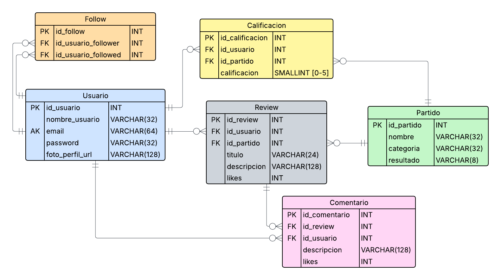

# PostMatch

## Tecnologias

## Indice
- [Integrantes del Proyecto](#integrantes-del-proyecto)
- [Descripción del Proyecto](#descripción-del-proyecto)
- [Diagrama Entidad Relación](#diagrama-entidad-relación)
- [Requerimientos funcionales](docs/requerimientos_funcionales.pdf)

## Integrantes del proyecto
- Juan Eduardo Diaz Rojas
- Felipe Garrido Flores
- Erick Salazar Suarez

## Descripción del proyecto

**PostMatch** es una aplicación móvil desarrollada en Android Studio que permite a los usuarios realizar reseñas (reviews) de partidos de fútbol. La aplicación no solo se enfoca en capturar opiniones sobre eventos deportivos, sino que también incorpora funcionalidades propias de una red social:

- Publicar y comentar reseñas de partidos.
- Puntuar partidos de acuerdo a la experiencia del usuario.
- Seguir a otros usuarios y ver su actividad.
- Notificaciones de nuevas interacciones.
- Historial de partidos reseñados y publicaciones.

Esta app está diseñada para fanáticos del fútbol que desean compartir su perspectiva de los encuentros, generar discusión, y construir comunidad a través de la experiencia deportiva.

## Diagrama Entidad Relación

