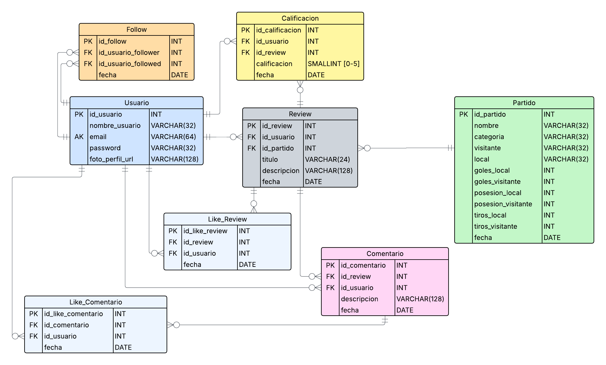

# PostMatch

## Tecnologias

## Indice
- [Integrantes del Proyecto](#integrantes-del-proyecto)
- [Descripción del Proyecto](#descripción-del-proyecto)
- [Diagrama Entidad Relación](#diagrama-entidad-relación)
- [Diagrama de Clases](#diagrama-clases)
- [Requerimientos funcionales](docs/requerimientos_funcionales.pdf)
- [Figma](#mockup-figma)
- [Pantallas principales](#pantallas-principales)

## Integrantes del proyecto
- Juan Eduardo Diaz Rojas
- Felipe Garrido Flores
- Erick Salazar Suarez
- Juan Bernardo Uribe Ramirez

## Descripción del proyecto

### Logo

  

**PostMatch** es una aplicación móvil desarrollada en Android Studio que permite a los usuarios realizar reseñas (reviews) de partidos de
fútbol. La aplicación no solo se enfoca en capturar opiniones sobre eventos deportivos, sino que también incorpora funcionalidades propias
de una red social:

- Publicar y comentar reseñas de partidos.
- Puntuar partidos de acuerdo a la experiencia del usuario.
- Seguir a otros usuarios y ver su actividad.
- Notificaciones de nuevas interacciones.
- Historial de partidos reseñados y publicaciones.

Esta app está diseñada para fanáticos del fútbol que desean compartir su perspectiva de los encuentros, generar discusión, y construir
comunidad a través de la experiencia deportiva.

## Paleta de Colores

| Nombre           | HEX      | Muestra |
|------------------|----------|---------|
| Verde O.         | `#121712` |  |
| Verde Pigmentado | `#1F241F` |  |
| Verde O2         | `#404F40` |  |
| Verde            | `#2B362B` |  |
| Verde Claro      | `#38AB3D` |  |
| Blanco           | `#FFFFFF` |  |

## Diagrama Entidad Relación

## Diagrama Clases

  

## Mockup figma  
[Figma - PostMatch](https://www.figma.com/design/AuSTbTEK20Tgqt2AiHOQUT/Untitled?node-id=0-1&p=f)

## Pantallas principales

Dentro de la aplicación se han diseñado varias pantallas que reflejan las funcionalidades principales de PostMatch. 
A continuación se muestran algunas de ellas:

**Crear reseña**

  

- El usuario selecciona un partido y puede escribir su reseña.
- Incluye un sistema de calificación con estrellas.
- Representa el núcleo de la aplicación, ya que permite compartir experiencias sobre los partidos.

**Perfil de usuario**

  

- Muestra la información básica del usuario, sus seguidores y seguidos.
- Incluye el historial de reseñas publicadas y guardadas.
- Permite seguir a otros usuarios, reforzando el carácter de red social de la app.

**Notificaciones**

  

- Presenta de forma clara las interacciones de otros usuarios con nuestras publicaciones.
- Permite al usuario estar al tanto de “me gusta” y reacciones recibidas en sus reseñas.
- Refuerza la dinámica de comunidad e interacción dentro de PostMatch.

**Detalle del partido**

  

- Muestra información completa de un partido específico: marcador, posesión, goles y tiros.
- Incluye la sección de reseñas de los usuarios, con calificación y comentarios.
- Facilita la interacción en torno a un evento deportivo puntual.

**Partidos destacados**

  

- Presenta los partidos más relevantes de la semana o del momento.
- Cada tarjeta muestra el resultado, el torneo (ej. Champions League, La Liga) y detalles del encuentro.
- Sirve como punto de inicio para que los usuarios elijan qué partido reseñar o consultar.

**Perfil de usuario**

  

- El perfil detalla la información básica del usuario, junto con seguidores y seguidos.
- Contiene un listado de reseñas con su calificación y comentarios.
- Refuerza la experiencia social al mostrar cómo otros usuarios interactúan con los partidos.